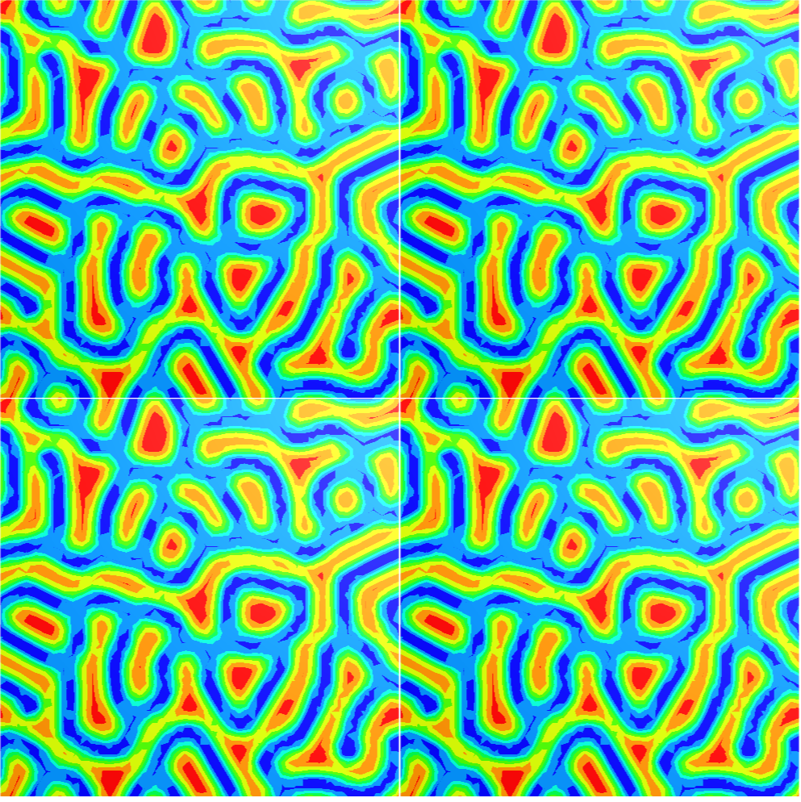

# Gray-Scott Reaction-Diffusion Simulator

This project implements the **Gray-Scott reaction-diffusion model** using [NGSolve](https://ngsolve.org/), a high-performance finite element library. It simulates the emergence of complex patterns from simple chemical interactions and visualizes how parameters affect the evolution of these patterns over time.



This was a collaborative project developed with my partner as part of our exploration into mathematical pattern formation and numerical simulation. I give her my special thanks.

## What is Reaction-Diffusion?

Reaction-diffusion systems model how substances react and diffuse through space. The **Gray-Scott model** is a two-variable system that simulates how an "activator" and an "inhibitor" interact. Despite its simplicity, it produces a wide variety of natural-looking patterns like spots, stripes, and waves — many of which resemble those seen in **animal coat markings**, **coral growth**, or **chemical reactions**.

## Inspiration

This model builds on the work of Alan Turing, who first proposed that reaction-diffusion equations could explain natural pattern formation in biological systems — from leopard spots to fish stripes. Later developments like the Gray-Scott model (Gray & Scott, 1984) and Pearson's work (1993) have shown how simple local interactions can lead to rich emergent behavior.

The patterns generated here mimic processes in morphogenesis, the study of how organisms develop their shape — and were a big inspiration behind this project.

## Features

- Full implementation of the Gray-Scott model in 2D
- Customizable parameters (diffusion, feed, kill rate, time step)
- Interactive visualization of pattern formation
- Periodic boundary conditions for seamless pattern tiling
- Support for different mesh geometries (square, circular, etc.)
- Efficient FEM discretization via NGSolve

## Parameters and Control

You can experiment with the following model parameters:

| Parameter | Description                       | Typical Values      |
|----------:|-----------------------------------|---------------------|
| `D_u`     | Diffusion rate of U (activator)   | 0.01 – 0.08         |
| `D_v`     | Diffusion rate of V (inhibitor)   | ~0.5 * D_u          |
| `F`       | Feed rate                         | 0.03 – 0.07         |
| `k`       | Kill rate                         | 0.055 – 0.065       |
| `dt`      | Time step                         | 1 – 2               |
| `iterations` | Number of time steps           | 1000 – 5000         |

Please note that most configurations that are outside the boundaries of function of the system will quickly lead to chaotic or exploding / diminishing values that will break the simulation.

The notebook includes some sample values that produce interesting patterns.

## Running the Simulation

To run the simulation, use the sagma function with your parameters. For example:

```python
sagma(D_u=0.064, F=0.035, k=0.057, dt=1, iterations=3000)
```

Output will be shown directly in the Jupyter notebook interface using NGSolve's built-in visualizer.


